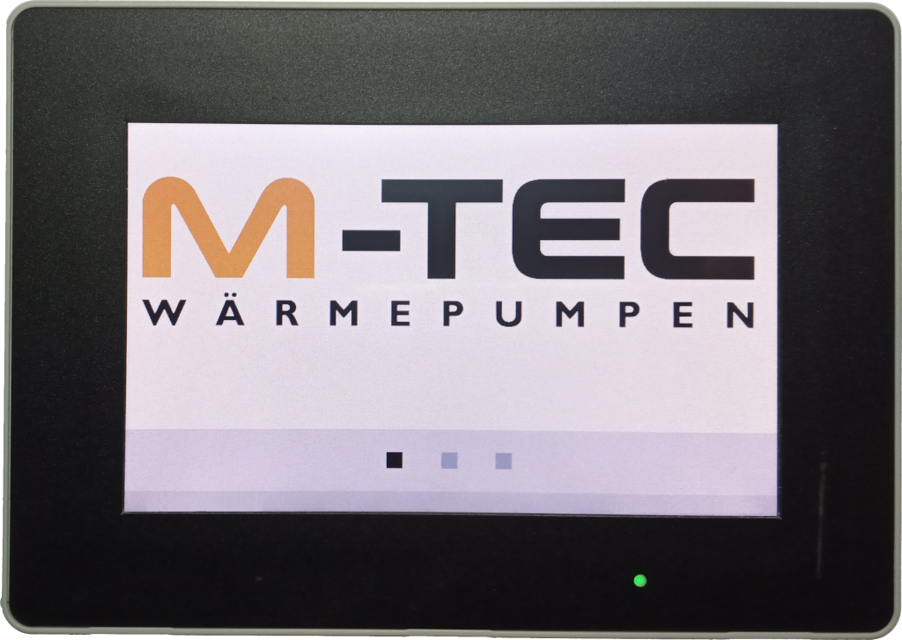
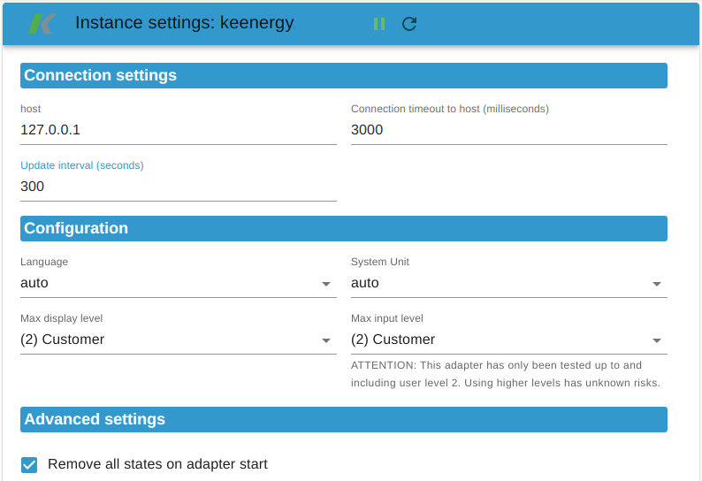

# ioBroker.keenergy

**Tests:** 

## keenergy adapter for ioBroker

Adapter for KEBA KeEnergy Web HMI - Remote Control

**This adapter connects to your KeEnergy Web HMI in your local network (no cloud access!) and provides the states in your ioBroker.
You can also change certain states if allowed by definition of your Web HMI.**

## Configuration

### Host

This can either be a IP-address or a hostname to the webinterface of your Web HMI

### Connection timeout

**UNIT:** milliseconds

Each connection has a timeout that must not be exceeded.
Large timeouts may block your system. Too small timeouts may break your connections before Web HMI could respond.

You can adapt this timeout depending on your network speed.

### Update interval

**UNIT:** seconds

All states are updated in a periodical interval.
Specifying to small intervals may overload either your ioBroker or your Web HMI. Larger intervals have the consequence that your data may be outdated.

### Language

The language is used to get the descriptions of the objects.

### System Unit

The system unit is used to describe the units of your data.

### Max display level / Max input level

Each data point contains a display level or a max input level to be protected from unauthorized access.
The display level defines the read access to the data whereas the input level decides for the write access.

The following user levels are known:
* (1) Easy
* (2) Customer
* (3) Servicetengineer
* (4) Serviceadmin
* (10) Manufacturer
* (99) Developer

### Remove all states on adapter start

By setting this option, all data points are removed on restarting your adapter.
This may be helpful if the system unit or language has changed or for debugging purpose.

## Contribution and Development

If you want to contribute have a look at the [Developer Guide](./doc/CONTRIBUTE.md)

## Changelog

<!--
  Placeholder for the next version (at the beginning of the line):
  ### **WORK IN PROGRESS**
-->
### 0.2.0 (2024-09-18)
* (jb-io) refactored code to typescript
* (jb-io) update dependencies

### 0.1.1 (2022-10-02)
* (jb-io) prepare adapter for public usage

### 0.1.0
* (jb-io) first working release

### 0.0.1
* (jb-io) initial release

## License

[Licensed under GPLv3](LICENSE) Copyright (c) 2024 jb-io
